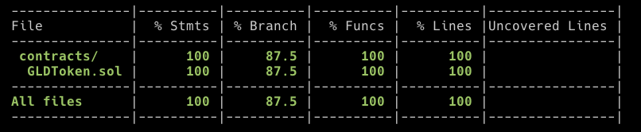

# Instructions

1. Install npm: `npm install npm@latest -g`
2. Log into npm: `npm login`
3. Clone the repository: `git clone git@github.com:state-space/demo-erc20.git`
4. Change directory into demo-erc20: `cd demo-erc20`
5. Install the dependencies: `npm install`
6. Install the npm plugin: `npm install @statespace/hardhat-testgen`
7. Add `import "@statespace/hardhat-testgen"` to the top of the `hardhat.config.ts` file.
8. Replace the entire `hardhat.config.ts` file with the following contents:

```
import { HardhatUserConfig } from "hardhat/config";
import "@nomicfoundation/hardhat-toolbox";
import "@statespace/hardhat-testgen";

const config: HardhatUserConfig = {
  solidity: "0.8.16",
  testgen: {
    validAbiOnly: true
  }
};

export default config;
```

9. Compile the contracts: `npx hardhat compile`
10. Generate tests: `npx hardhat testgen`
11. Run tests: `npx hardhat test`
12. Run coverage: `npx hardhat coverage`
13. Open the coverage report: `open coverage/index.html`

# Increase depth

The default depth is 1. To use a depth of 2, replace the entire `hardhat.config.ts` file with the following contents:

```
import {HardhatUserConfig} from "hardhat/config";
import "@nomicfoundation/hardhat-toolbox";
import "@statespace/hardhat-testgen"

const config: HardhatUserConfig = {
  solidity: "0.8.16",
  testgen: {
    depth: 2,
  },
};

export default config;

```

# Upgrade the plugin

1. `npm uninstall @statespace/hardhat-testgen`
2. `npm install @statespace/hardhat-testgen`


# Expected Coverage:

At depth 2:




The branch coverage is not 100% because two branches are deadcode:

1. The branch `require(from != address(0)` on line 313 in `_transfer` is deadcode because `_transfer` is only called from `transfer` and `transferFrom`: 
* The `transfer` function has `from` set to `msg.sender` which can never be `address(0)`. 
* The `transferFrom` function calls `_spendAllowance` before `_transfer` which behaves in two different ways: 1) either `allowance[from][msg.sender]` is equal to `uint256.max` or the `_approve` function is called on `from`. Either way, in order to reach line 313, an `approve` function on `from` would have been called, thereby preventing the require(from != address(0) to ever be false.

2. The branch `require(account != address(0)` on line 340 in `_mint` is deadcode because `_mint` is only called from the constructor where `account` is the `msg.sender` which can never be `address(0)`. 


# Executed Runs

The following repositories are forks that have the generated tests and coverage reports committed for easy access to results:

* https://github.com/state-space/demo-erc20-depth-2
* https://github.com/state-space/demo-erc20-depth-3
* https://github.com/state-space/demo-ecrecover-depth-2

# Talking points

* Branch coverage increases from 81.25% to 87.5% when increasing from depth 1 to depth 2
* ERC20Permit with ecrecover is a good example of a program that’s infeasible for fuzzing tools
* 87.5% branch coverage is the maximum for this benchmark due to deadcode branches
* Deadcode can be removed to optimize gas usage.
